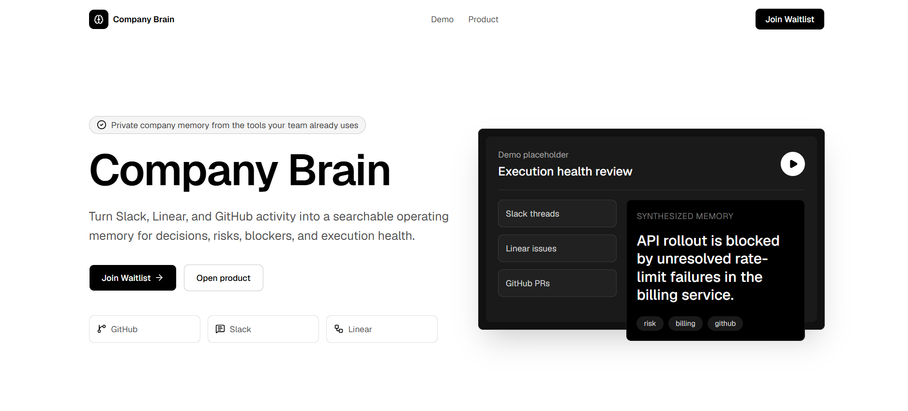
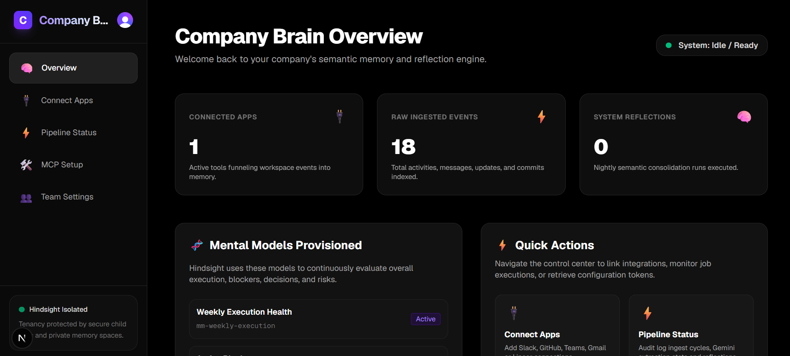
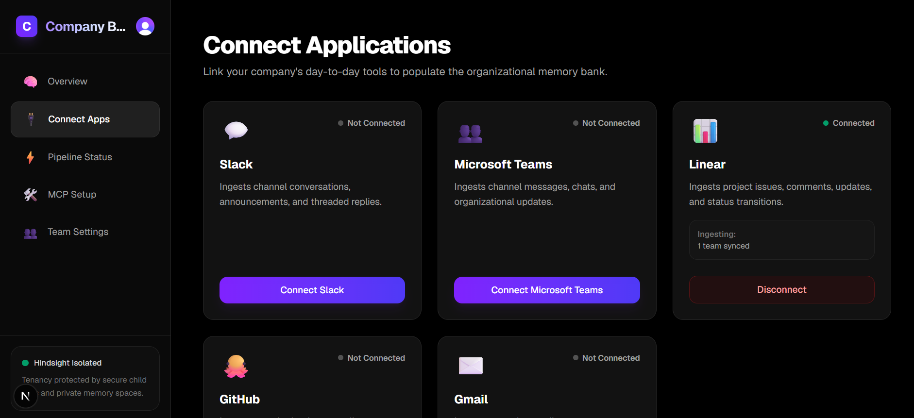
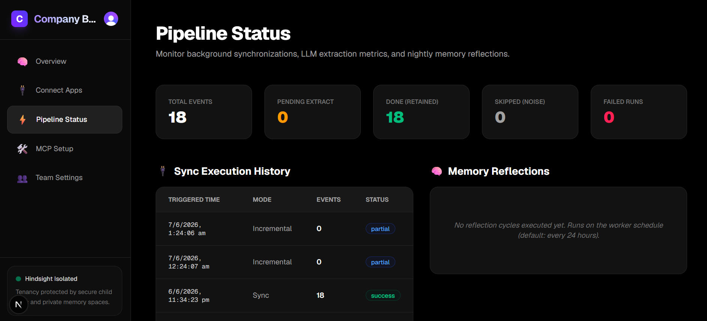
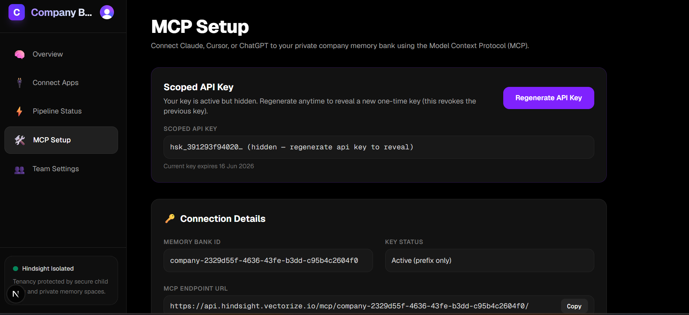
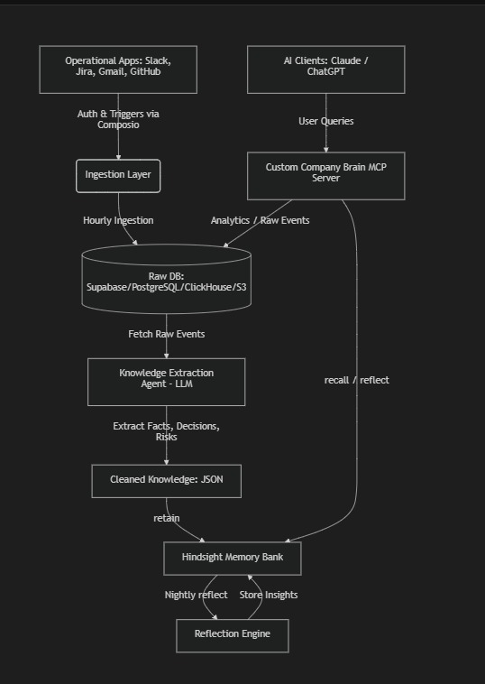

<div align="center">

<!-- 🖼️ LOGO PLACEHOLDER -->
<!-- Replace with:  -->

# Company Brain

**The organizational intelligence layer that never sleeps.**

*Connect your tools. Extract signal. Surface what leadership needs to know.*

[](https://github.com/YOUR_ORG/company-brain/actions)
[](https://github.com/YOUR_ORG/company-brain/releases)
[](./LICENSE)
[](https://github.com/YOUR_ORG/company-brain/stargazers)

<div align="center">
  <!-- 📸 SCREENSHOT PLACEHOLDER -->
  <!-- Replace with: npx screenshot-tool http://localhost:3000/ -->
  <!-- Save as: ./assets/screenshots/dashboard-overview.png -->
  <!-- Recommended dimensions: 1280×800px, retina: 2560×1600px -->
  
  <p><em>The Company Brain — live KPIs, mental model status, and quick-action controls</em></p>
</div>

[Quick Start](#-quick-start) · [Docs](#-usage) · [Report Bug](https://github.com/YOUR_ORG/company-brain/issues) · [Request Feature](https://github.com/YOUR_ORG/company-brain/issues)

</div>

---

## 📋 Table of Contents

- [Overview](#-overview)
- [Features](#-features)
- [Screenshots](#-screenshots)
- [Quick Start](#-quick-start)
- [Installation](#-installation)
- [Usage](#-usage)
- [Architecture](#-architecture)
- [Configuration](#-configuration)
- [API Reference](#-api-reference)
- [Contributing](#-contributing)
- [Roadmap](#-roadmap)
- [License](#-license)
- [Acknowledgments](#-acknowledgments)

---

## 🧠 Overview

**Company Brain** is a semantic memory system for organizations. It continuously ingests activity from your connected tools (Slack, GitHub, Linear, Teams, Gmail), uses Gemini to extract operational signals (decisions, risks, blockers, milestones), stores them in a persistent vector memory bank via Hindsight, and runs periodic reflection passes to synthesize leadership-grade observations.

Built for engineering and product leaders who need a real-time pulse on what's happening across their teams — without reading every message.

```
┌─────────────────────────────────────────────────┐
│  ✅ Multi-tenant, per-company memory isolation  │
│  ✅ Gemini-powered AI extraction (OpenAI-compat)│
│  ✅ MCP server endpoint for Cursor / Claude     │
└─────────────────────────────────────────────────┘
```

---

## ✨ Features

| | Feature | Description |
|---|---|---|
| 🔌 | **Multi-App Ingestion** | Connects Slack, Microsoft Teams, GitHub, Linear, and Gmail via Composio OAuth |
| 🤖 | **AI Signal Extraction** | Gemini 2.0 Flash classifies every event into facts, decisions, risks, action items, and milestones |
| 🧠 | **Persistent Vector Memory** | All extracted knowledge is retained in a Hindsight Memory Bank with tenant isolation |
| 🪞 | **Nightly Reflection** | Scheduled synthesis pass queries the bank with leadership questions and re-retains observations |
| 🛠️ | **MCP Integration** | Exposes a Model Context Protocol endpoint so Cursor and Claude Desktop can query company memory directly |
| 🗂️ | **Mental Models** | Provisions four standing mental models: Execution Health, Active Blockers, Recent Decisions, Engineering Risks |
| 🔒 | **Scoped API Keys** | Per-company read-only Hindsight keys with configurable TTL for secure MCP access |
| 📊 | **Pipeline Dashboard** | Full audit log of every ingestion run, extraction metric, and reflection cycle |
| 🏢 | **Multi-Tenant Auth** | Clerk organization-based authentication with role-aware onboarding |
| ⚡ | **Deduplication** | SHA-256-keyed upserts ensure no event is extracted twice, even across overlapping ingestion windows |

---

## 📸 Screenshots

### Dashboard Overview

> The main control center — live sync status, KPI counters, mental model roster, and quick-action navigation.

<div align="center">
  <!-- 📸 SCREENSHOT PLACEHOLDER -->
  <!-- Replace with: npx screenshot-tool http://localhost:3000/ -->
  <!-- Save as: ./assets/screenshots/dashboard-overview.png -->
  <!-- Recommended dimensions: 1280×800px, retina: 2560×1600px -->
  
  <p><em>Connected Apps · Raw Events · System Reflections — all at a glance</em></p>
</div>

---

### Connect Apps

> OAuth integration manager — connect or disconnect Slack, GitHub, Teams, Linear, and Gmail with one click.

<div align="center">
  <!-- 📸 SCREENSHOT PLACEHOLDER -->
  <!-- Replace with: npx screenshot-tool http://localhost:3000/connect -->
  <!-- Save as: ./assets/screenshots/connect-apps.png -->
  <!-- Recommended dimensions: 1280×800px, retina: 2560×1600px -->
  
  <p><em>Connect your workspace tools to begin ingesting organizational activity</em></p>
</div>

---

### Pipeline Status

> Full observability into every ingestion run, Gemini extraction metric, and nightly reflection cycle.

<div align="center">
  <!-- 📸 SCREENSHOT PLACEHOLDER -->
  <!-- Replace with: npx screenshot-tool http://localhost:3000/pipeline -->
  <!-- Save as: ./assets/screenshots/pipeline-status.png -->
  <!-- Recommended dimensions: 1280×800px, retina: 2560×1600px -->
  
  <p><em>Extraction metrics (pending / done / skipped / failed) alongside sync and reflection history</em></p>
</div>

---

### MCP Configuration

> Retrieve the company's scoped Hindsight API key and copy the MCP server URL for Cursor or Claude Desktop.

<div align="center">
  <!-- 📸 SCREENSHOT PLACEHOLDER -->
  <!-- Replace with: npx screenshot-tool http://localhost:3000/mcp -->
  <!-- Save as: ./assets/screenshots/mcp-setup.png -->
  <!-- Recommended dimensions: 1280×800px, retina: 2560×1600px -->
  
  <p><em>One-click key generation and MCP endpoint URL for AI IDE integration</em></p>
</div>

---

### Onboarding

> Guided setup flow — create or join a Clerk organization, provision the Hindsight Memory Bank, and generate the initial scoped API key.

<div align="center">
  <!-- 📸 SCREENSHOT PLACEHOLDER -->
  <!-- Replace with: npx screenshot-tool http://localhost:3000/onboarding -->
  <!-- Save as: ./assets/screenshots/onboarding.png -->
  <!-- Recommended dimensions: 1280×800px, retina: 2560×1600px -->
  
  <p><em>New organizations are provisioned with a Hindsight bank and four mental models in one step</em></p>
</div>

---

## ⚡ Quick Start

```bash
# 1. Clone and install dependencies
git clone https://github.com/YOUR_ORG/company-brain.git && cd company-brain && pnpm install

# 2. Copy env template and fill in your keys (see Configuration section)
cp .env.example .env

# 3. Push the database schema to Supabase
pnpm db:push

# 4. Start the Web Application and Pipeline Worker in separate terminals
pnpm dev          # Terminal 1 — Next.js on http://localhost:3000
pnpm dev:worker   # Terminal 2 — Pipeline Worker with tsx watch
```

---

## 🛠️ Installation

### Prerequisites

| Tool | Minimum Version | Notes |
|---|---|---|
| Node.js | 20.x | LTS recommended |
| pnpm | 9.x | `npm install -g pnpm` |
| Supabase project | — | Free tier works; needs Postgres connection strings |
| Clerk account | — | Organization feature must be enabled |
| Composio account | — | For OAuth tool connections |
| Hindsight Cloud account | — | [ui.hindsight.vectorize.io](https://ui.hindsight.vectorize.io) — enable "Allow creating scoped child keys" on your parent API key |
| Gemini API key | — | Google AI Studio — `gemini-2.0-flash` is the default model |

### Install from source

```bash
# Clone the repository
git clone https://github.com/YOUR_ORG/company-brain.git
cd company-brain

# Install all workspace dependencies
pnpm install

# Configure environment
cp .env.example .env
# Edit .env with your credentials (see Configuration section)

# Push schema to Supabase (uses DATABASE_DIRECT_URL on port 5432)
pnpm db:push

# Build everything for production
pnpm build

# Start with PM2 (manages both web + worker processes)
pnpm start:all
```

### Production deployment (PM2)

```bash
# After building, start both processes managed by PM2
pnpm start:all

# Or start individually
pnpm start          # Web Application only
pnpm start:worker   # Pipeline Worker only
```

---

## 📖 Usage

### Basic: Running a Manual Pipeline

The Pipeline Worker runs automatically on the configured interval. For a manual trigger via HTTP:

```bash
# Trigger an incremental pipeline for a specific company
curl -X POST http://localhost:3000/api/cron/pipeline \
  -H "Content-Type: application/json" \
  -H "Authorization: Bearer $CRON_SECRET" \
  -d '{ "companyId": "your-company-uuid" }'

# Response
{
  "success": true,
  "runId": "abc123...",
  "extraction": {
    "processed": 42,
    "skipped": 8,
    "failed": 0
  }
}
```

### Worker: Scheduled Pipeline and Reflection

The `@company-brain/worker` process runs on startup and repeats on configured intervals:

```typescript
// apps/worker/src/index.ts — simplified view of what the worker does

// On startup: immediately run pipelines for all active companies
void runScheduledPipelines();

// Repeat every PIPELINE_INTERVAL_MS (default: 1 hour)
setInterval(() => void runScheduledPipelines(), PIPELINE_INTERVAL_MS);

// Repeat every REFLECTION_INTERVAL_MS (default: 24 hours)
setInterval(() => void runScheduledReflection(), REFLECTION_INTERVAL_MS);
```

For faster iteration during development, add `.env.local` with short intervals:

```bash
# .env.local — overrides .env for local dev
PIPELINE_INTERVAL_MS=60000    # Run pipeline every 60 seconds
REFLECTION_INTERVAL_MS=120000 # Run reflection every 2 minutes
```

### Advanced: Extraction Pipeline Internals

Each pipeline run calls ingestion → extraction in sequence, with up to 40 extraction batches per run:

```typescript
// packages/pipeline/src/run-company-pipeline.ts
const result = await runCompanyPipeline(db, {
  companyId: 'your-company-uuid',
  runType: 'incremental', // or 'backfill' for a 48-hour history pull
});
// result.extraction = { processed: N, skipped: N, failed: N }
```

The extraction step uses Gemini to classify each raw event into typed knowledge items:

```typescript
// Extracted item shape — validated with Zod
{
  type: 'fact' | 'decision' | 'risk' | 'action_item' | 'milestone',
  content: 'string — standalone, self-contained statement',
  confidence: 0.0–1.0,
  entities: ['ProjectX', 'Alice', 'auth-service']
}
```

---

## 🏗️ Architecture

```
┌──────────────────────────────────────────────────────────────────────────────┐
│                           COMPANY BRAIN MONOREPO                             │
│                                                                              │
│  ┌─────────────────────────────┐    ┌───────────────────────────────────┐   │
│  │     apps/web (Next.js 16)   │    │    apps/worker (Node / tsx)       │   │
│  │                             │    │                                   │   │
│  │  /           Dashboard      │    │  - runScheduledPipelines()        │   │
│  │  /connect    OAuth manager  │    │    every PIPELINE_INTERVAL_MS     │   │
│  │  /pipeline   Audit log      │    │                                   │   │
│  │  /mcp        Key + URL      │    │  - runScheduledReflection()       │   │
│  │  /onboarding Org setup      │    │    every REFLECTION_INTERVAL_MS   │   │
│  │                             │    │                                   │   │
│  │  API Routes:                │    │  Runs Connect Backfill is done    │   │
│  │  POST /api/cron/pipeline    │    │  by the Web App, not the Worker   │   │
│  │  POST /api/cron/reflection  │    │                                   │   │
│  │  GET  /api/composio/callback│    └──────────────┬────────────────────┘   │
│  └──────────────┬──────────────┘                   │                        │
│                 │                                   │                        │
│        ┌────────▼────────────────────────────────── ▼──────────┐            │
│        │               packages/pipeline                        │            │
│        │   runCompanyPipeline(db, { companyId, runType })       │            │
│        │   └── runIngestionPipeline()  →  runExtractionPipeline │            │
│        └──────────────────────────────────────────────────────-─┘            │
│                 │                         │                                  │
│        ┌────────▼─────────┐    ┌──────────▼──────────┐                      │
│        │ packages/ingest. │    │ packages/extraction  │                      │
│        │ Composio adapters│    │ Gemini Flash (via    │                      │
│        │ Slack, Teams,    │    │ OpenAI-compat SDK)   │                      │
│        │ Linear, GitHub,  │    │ → Hindsight retain() │                      │
│        │ Gmail            │    └──────────────────────┘                      │
│        └────────┬─────────┘                                                  │
│                 │                                                             │
│        ┌────────▼───────────────────────────────────┐                       │
│        │  packages/db  (Drizzle ORM + Supabase PG)  │                       │
│        │  companies · members · connectedAccounts    │                       │
│        │  rawEvents · ingestionRuns · extractionJobs │                       │
│        │  reflectionRuns                             │                       │
│        └─────────────────────────────────────────────┘                       │
└──────────────────────────────────────────────────────────────────────────────┘

External Services:
  ┌──────────────┐  ┌──────────────┐  ┌──────────────┐  ┌────────────────┐
  │  Clerk Auth  │  │  Composio    │  │  Hindsight   │  │  Google Gemini │
  │  (Org + JWT) │  │  (OAuth +    │  │  Cloud       │  │  2.0 Flash API │
  └──────────────┘  │   tool APIs) │  │  (Vector DB  │  │  (extraction)  │
                    └──────────────┘  │   + MCP srv) │  └────────────────┘
                                      └──────────────┘
```

### Tech Stack

| Layer | Technology |
|---|---|
| Web Application | Next.js 16, React 19, Tailwind CSS v4 |
| Pipeline Worker | Node.js, tsx (TypeScript runner) |
| Authentication | Clerk (organization-scoped, webhooks for provisioning) |
| Database | Supabase Postgres, Drizzle ORM (schema push + migrations) |
| Tool Connectivity | Composio (Slack, Teams, GitHub, Linear, Gmail adapters) |
| AI Extraction | Google Gemini 2.0 Flash via OpenAI-compatible SDK |
| Vector Memory | Hindsight Cloud (retain, reflect, mental models, MCP) |
| Process Management | PM2 (`ecosystem.config.js`) |
| Monorepo | pnpm workspaces |

### Data Flow

A Pipeline run begins when the Pipeline Worker (or a manual trigger) calls `runCompanyPipeline`. The ingestion stage fetches raw events from every active connected account via Composio, deduplicates them with a SHA-256 key, and writes them to `raw_events` in Supabase. The extraction stage then processes each `pending` event in batches: Gemini classifies each into typed knowledge items, which are immediately retained in the company's isolated Hindsight Memory Bank. At the configured reflection interval, five leadership-oriented queries are run against the bank; the resulting observations are re-retained as dated documents (`reflection:key:YYYY-MM-DD`) and logged to `reflection_runs`. The MCP endpoint served by Hindsight Cloud then makes the entire bank queryable by any MCP-compatible AI client.

---

## ⚙️ Configuration

Copy `.env.example` to `.env` and populate every required variable before starting.

| Variable | Required | Default | Description |
|---|---|---|---|
| `NEXT_PUBLIC_APP_URL` | ✅ | `http://localhost:3000` | Public URL of the Web Application (used for OAuth callbacks) |
| `NODE_ENV` | ✅ | `development` | `development` or `production` |
| `CRON_SECRET` | ✅ | — | Bearer token guarding the `/api/cron/*` routes in production |
| `PIPELINE_INTERVAL_MS` | — | `3600000` (1 h) | How often the Pipeline Worker runs scheduled pipelines (ms) |
| `REFLECTION_INTERVAL_MS` | — | `86400000` (24 h) | How often the Pipeline Worker runs reflection (ms) |
| `NEXT_PUBLIC_CLERK_PUBLISHABLE_KEY` | ✅ | — | Clerk publishable key (`pk_test_…` or `pk_live_…`) |
| `CLERK_SECRET_KEY` | ✅ | — | Clerk secret key (`sk_test_…` or `sk_live_…`) |
| `CLERK_WEBHOOK_SIGNING_SECRET` | ✅ | — | Clerk webhook signing secret (`whsec_…`) for org membership sync |
| `NEXT_PUBLIC_CLERK_SIGN_IN_URL` | — | `/sign-in` | Clerk sign-in redirect path |
| `NEXT_PUBLIC_CLERK_SIGN_UP_URL` | — | `/sign-up` | Clerk sign-up redirect path |
| `NEXT_PUBLIC_CLERK_AFTER_SIGN_IN_URL` | — | `/onboarding` | Redirect after successful sign-in |
| `NEXT_PUBLIC_CLERK_AFTER_SIGN_UP_URL` | — | `/onboarding` | Redirect after successful sign-up |
| `DATABASE_URL` | ✅ | — | Supabase Postgres **transaction pooler** URL (port `6543`, `?pgbouncer=true`) |
| `DATABASE_DIRECT_URL` | — | — | Supabase Postgres **direct** URL (port `5432`); required by `drizzle-kit push` |
| `SUPABASE_URL` | ✅ | — | Supabase project URL (`https://[ref].supabase.co`) |
| `SUPABASE_SERVICE_ROLE_KEY` | ✅ | — | Supabase service role key (server-side only) |
| `COMPOSIO_API_KEY` | ✅ | — | Composio platform API key |
| `HINDSIGHT_API_URL` | ✅ | `https://api.hindsight.vectorize.io` | Hindsight Cloud API base URL |
| `HINDSIGHT_API_KEY` | ✅ | — | Hindsight parent API key — **must** have "Allow creating scoped child keys" enabled |
| `GEMINI_API_KEY` | ✅ | — | Google Gemini API key (AI Studio) |
| `GEMINI_MODEL` | — | `gemini-2.0-flash` | Gemini model name used for extraction |
| `GEMINI_API_BASE_URL` | — | `https://generativelanguage.googleapis.com/v1beta/openai/` | Gemini OpenAI-compatible endpoint base URL |

---

## 🔌 API Reference

### `POST /api/cron/pipeline`

Manually trigger an incremental pipeline for a company. Protected by `CRON_SECRET` in production.

**Request**
```json
{
  "companyId": "uuid-of-the-target-company"
}
```

**Response `200`**
```json
{
  "success": true,
  "runId": "3fa85f64-5717-4562-b3fc-2c963f66afa6",
  "extraction": {
    "processed": 42,
    "skipped": 8,
    "failed": 0
  }
}
```

**Response `401`** — Missing or invalid `Authorization: Bearer <CRON_SECRET>` header (production only).

**Response `400`** — `companyId` was not provided in the body or query string.

---

### `POST /api/cron/reflection`

Manually trigger the nightly reflection pass for a company. Same auth rules as the pipeline route.

**Request**
```json
{
  "companyId": "uuid-of-the-target-company"
}
```

**Response `200`**
```json
{
  "success": true,
  "runsCount": 5,
  "errors": []
}
```

---

### `GET /api/composio/callback`

OAuth redirect handler. Composio redirects here after a member authorizes a tool connection. Triggers a Connect Backfill pipeline for the newly connected toolkit only. No body required — query parameters are handled internally.

---

## 🤝 Contributing

1. **Fork** the repository and clone your fork
2. **Branch** off `main` — use `feat/`, `fix/`, or `chore/` prefixes
3. **Commit** with [Conventional Commits](https://www.conventionalcommits.org/) (`feat: add X`, `fix: correct Y`)
4. **Open a Pull Request** against `main` with a clear description of the change

### Development commands

```bash
pnpm dev            # Start the Web Application (Next.js dev server)
pnpm dev:worker     # Start the Pipeline Worker (tsx watch mode)
pnpm lint           # Lint all packages
pnpm build          # Build all packages and apps for production
pnpm db:push        # Push Drizzle schema changes to Supabase
pnpm db:migrate     # Run pending Drizzle migrations
```

See [CONTRIBUTING.md](./CONTRIBUTING.md) for detailed guidelines. [TODO: create CONTRIBUTING.md]

---

## 🗺️ Roadmap

- [x] Multi-tenant Clerk organization authentication
- [x] Composio OAuth adapters: Slack, Teams, GitHub, Linear, Gmail
- [x] Gemini-powered signal extraction with Zod validation
- [x] Hindsight Memory Bank provisioning with mental models
- [x] Scheduled Pipeline Worker (incremental + backfill)
- [x] Nightly Reflection with observation re-retention
- [x] Scoped API key minting for MCP access
- [x] Pipeline audit dashboard with extraction metrics
- [ ] Per-channel and per-repo granular ingestion scoping UI
- [ ] Webhook-driven real-time ingestion (vs. polling)
- [ ] Slack notification integration for reflection summaries
- [ ] Multi-region deployment support
- [ ] Self-hosted Hindsight backend option

---

## 📄 License

Distributed under the MIT License. See `LICENSE` for details.

---

## 🙏 Acknowledgments

- **[Hindsight / Vectorize](https://hindsight.vectorize.io)** — vector memory bank, mental models, MCP server, and scoped API key infrastructure that powers the core memory layer
- **[Composio](https://composio.dev)** — OAuth tool connectivity and managed API adapters for Slack, Teams, GitHub, Linear, and Gmail
- **[Google Gemini](https://ai.google.dev)** — `gemini-2.0-flash` powers the organizational signal extraction pipeline
- **[Clerk](https://clerk.com)** — organization-scoped authentication and webhook-based provisioning
- **[Supabase](https://supabase.com)** — managed Postgres with PgBouncer connection pooling
- **[Drizzle ORM](https://orm.drizzle.team)** — type-safe schema, push-based migrations, and relational queries
- **[Next.js](https://nextjs.org)** — Web Application framework (App Router, server components)

---

<div align="center">

Made with ❤️ by the Company Brain team

⭐ Star this repo if it helped you!

</div>
